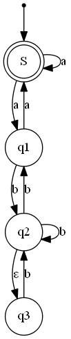
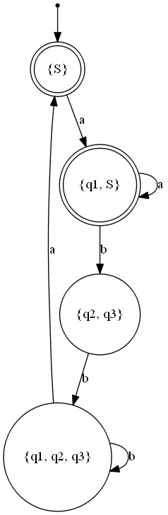

# NFA Powerset constructruction

Creates a DFA based on a given NFA. For more information on the procedure have a look at [Powerset construction](https://en.wikipedia.org/wiki/Powerset_construction).

Reads in Graphs formatted in the [DOT language](https://graphviz.gitlab.io/_pages/doc/info/lang.html) format by [GraphViz](https://graphviz.gitlab.io/).

Following format should be considered:
 - Normal or doublecircled nodes represent states
 - Edges with labels represent state transitions, edges without labels represent &epsilon; transitions
 - Accepting states have shape "doublecircle"
 - Initial states are marked by a state with shape "point" and an edge towards the initial state
 - The name "\_\_init" may not be used for any node

Outputs an equivalent DNF in DOT language format

Example:
```
digraph finite_state_machine {

    S [shape = doublecircle];
    qi [shape = point ]; 
    
    node [shape = circle];
    qi -> S;
    S  -> q1 [ label = "a" ];
    S  -> S  [ label = "a" ];
    q1 -> S  [ label = "a" ];
    q1 -> q2 [ label = "b" ];
    q2 -> q1 [ label = "b" ];
    q2 -> q2 [ label = "b" ];
    q2 -> q3 [ label = "&epsilon;"];
    q3 -> q2 [ label = "a" ];
}

-- Result ->

digraph {

    "__init" [shape = point];
    "{q1, S}" [shape = doublecircle];
    "{q2, q3}" [shape = circle];
    "{q1, q2, q3}" [shape = circle];
    "{S}" [shape = doublecircle];

    __init -> "{S}";

    "{q1, S}" -> "{q1, S}" [label = "a"];
    "{q1, S}" -> "{q2, q3}" [label = "b"];
    "{q2, q3}" -> "{q1, q2, q3}" [label = "b"];
    "{q1, q2, q3}" -> "{S}" [label = "a"];
    "{q1, q2, q3}" -> "{q1, q2, q3}" [label = "b"];
    "{S}" -> "{q1, S}" [label = "a"];
}

```

Visualized with [GraphViz](https://graphviz.gitlab.io):

 ->  
